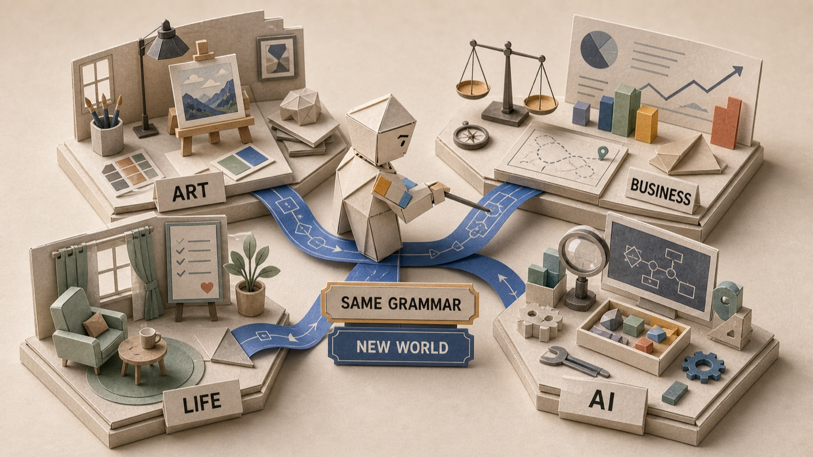
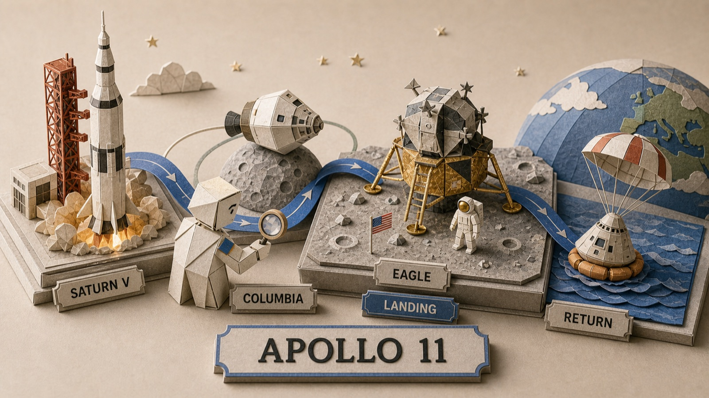
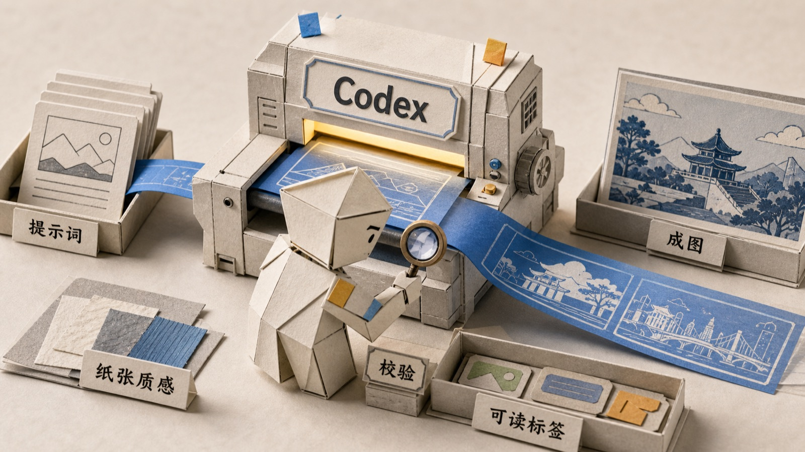
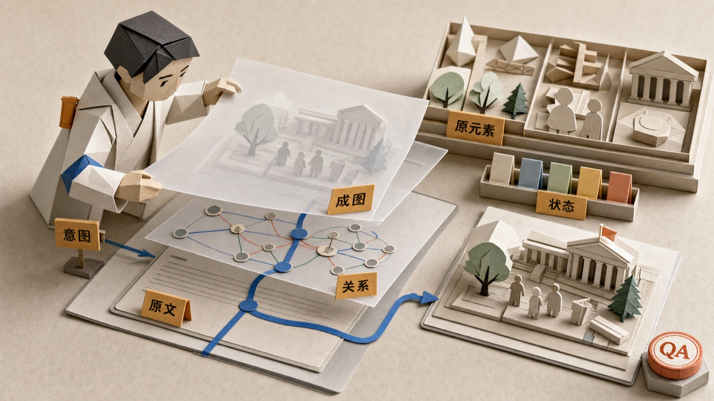
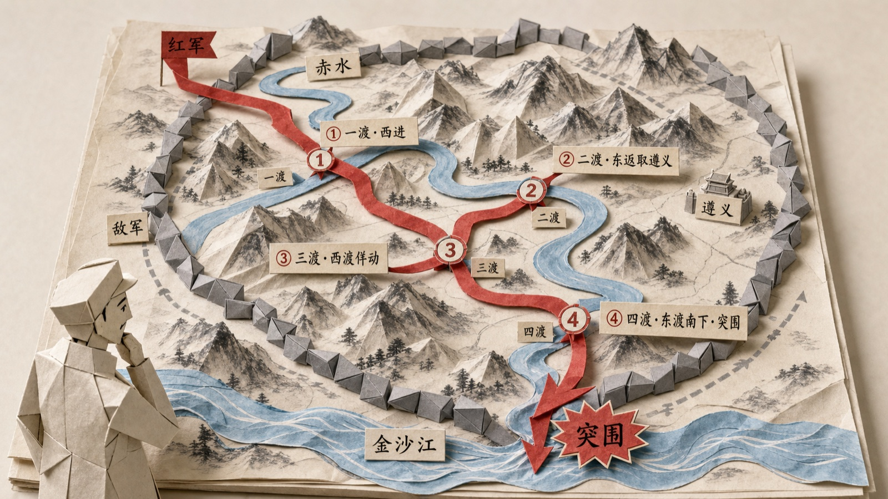

# Paper Operators

> Turn essays, books, stories, and systems into clear tactile visual cards, with a small paper operator physically performing the idea.

[中文](README.zh.md)

Paper Operators is built for people who write, explain, publish, teach, ship products, or make sense of complicated ideas. It turns a source paragraph, a book chapter, a story arc, or a product concept into a 16:9 paper-stage image where a small folded-paper operator performs the core action: framing, lighting, routing, inspecting, filtering, caring, weighing, archiving, or repairing.

It is not just a "make images for slides" prompt pack. It is a visual reasoning workflow. You can use it for article figures, story cards, book explainers, product narratives, learning cards, and multi-image editorial series.

This repository includes a ready-to-install Codex Skill, but the method is not Codex-only. Claude Code, Cursor, Hermes Agent, OpenClaw, or any agent tool that supports project rules, custom instructions, or workflow prompts can use the same guide.

It is not a mascot pack. It is a visual thinking tool.

## Why Codex Matters Here

Paper Operators is deliberately built around the kind of loop Codex is good at: read source material, improve the workflow, generate candidate prompts, render images, inspect artifacts, tighten rules, and write the lesson back into the repository. Codex is not only a renderer in this project; it acts as the maintainer workstation for a visual reasoning skill.

- **Codex turns the method into a shippable skill.** The repository contains the installable Skill, portable agent guides, showcase assets, smoke prompts, and QA rules rather than a one-off prompt.
- **Codex makes the visual proof visible.** Every image in the current showcase was rendered through Codex, which has produced the most reliable paper texture, readable labels, and operator action in testing.
- **Codex helps maintain cross-agent usefulness.** Claude Code, Cursor, Hermes Agent, OpenClaw, and other tools can plan with the workflow; Codex is the preferred path for final rendering and repo maintenance.
- **API credits would go directly into public OSS examples.** More credits mean more real article, book, product, and education examples, better failure analysis, and stronger reusable rules for people who cannot afford many image-generation retries.

More detail: [`docs/codex-workflow.md`](docs/codex-workflow.md).

<p align="center">
  
</p>

## What This Skill Does

- Finds the sentence, conflict, turn, plot beat, evidence point, or judgment worth visualizing.
- Routes the asset before drawing: article figure, story/book card, data story, center illustration, or reference-informed explainer.
- Converts abstract structure into physical paper action: reveal, route, weigh, frame, filter, repair, archive, or transform.
- Preserves truth constraints for labels, data, scientific parts, historical cues, and reference-specific objects.
- Chooses a paper-world metaphor that fits the domain: literature, culture, life, product, business, engineering, AI, education, psychology, and more.
- Produces readable Chinese or English labels by default, instead of empty label boxes.
- Keeps a consistent visual language across a whole package without making every image look the same.

The rule is simple: if removing the paper operator does not weaken the image, the operator should not be there.

## Showcase

> Every image below was rendered by **Codex**. On the rendering layer today, **Codex gives the best results** — paper texture, dimensional paper models, readable labels, and operator action all come out most reliably. Handing the `final image prompt` to Codex is the currently recommended way to render.

### Story Cards · Understand a classic in one glance

Paper Operators is not limited to presentation graphics. It can compress a familiar book or story into a fast-readable visual card: character, conflict, turning points, consequence, and transformation.

<p align="center">
  
  <br><sub><strong>A Christmas Carol as a story card.</strong> Scrooge moves through Past, Present, Future, Choice, Change, and Generosity. The blue ribbon carries the plot; the warm lantern marks the moral transformation.</sub>
</p>

### Visual Reasoning · From source text to image

<p align="center">
  
  <br><sub><strong>Visual reasoning engine.</strong> The operator reveals the hidden relation inside the source, then routes it through intent, primitives, state, image, and QA.</sub>
</p>

### One Grammar · Many worlds

<p align="center">
  
  <br><sub><strong>Same grammar, new world.</strong> The same operator logic travels across art, business, life, and AI without collapsing into a single workflow template.</sub>
</p>

### Data Stories · Keep the numbers, show the implication

Paper Operators can support data communication without pretending to be a strict chart renderer. The numbers stay exact; the operator action explains what needs attention.

<p align="center">
  
  <br><sub><strong>Data story scene.</strong> A sample status board preserves exact values while the operator turns risk into a review action: Open 12, At Risk 5, Blocked 2, Done 31.</sub>
</p>

### Reference-Informed Explainers · Recognizable, not copied

For science, history, geography, artifacts, brands, and technical objects, Paper Operators can use stable reference cues so the image explains the real thing instead of hallucinating a generic symbol.

<p align="center">
  
  <br><sub><strong>Apollo 11 as a reference-informed explainer.</strong> Saturn V, Columbia, Eagle, landing, and return become a tactile mission path with recognizable cues and no copied source image.</sub>
</p>

### Series Control · One argument across many images

<p align="center">
  
  <br><sub><strong>Series control.</strong> A blue ribbon carries one narrative through Idea, Route, Check, and Deliver, so a whole set reads as one argument rather than unrelated pictures.</sub>
</p>

### Codex · Rendering workshop

<p align="center">
  
  <br><sub><strong>Codex rendering workshop.</strong> The prompt rides a blue work ribbon into the Codex paper machine and comes out as an article figure with paper texture, readable labels, and a verification action.</sub>
</p>
<p align="center">
  
  <br><sub><strong>The reasoning stack made visible.</strong> The operator lifts translucent analysis layers, linking source text, intent, relationship, primitives, state, final image, and QA into an inspectable visual production chain.</sub>
</p>

### v2 · Chained series: one blue work ribbon, one whole article

An article about "going from one person asking, to organizing a team of Agents to deliver a verifiable result." Four body images share the same thread runner and palette; the blue work ribbon's state advances image to image, and the `校验 / verify` stamp motif goes from "pending" to "stamped." This is the new **series chaining** capability.

<p align="center">
  
  <br><sub><strong>① Opening · the question.</strong> The operator pulls a loose blue ribbon off the idea/question/intent cards; the route is unrouted, the verify stamp is pending.</sub>
</p>
<p align="center">
  
  <br><sub><strong>② Build · delegation.</strong> The same ribbon, now taut, branches to Agents A / B / C — intent becomes parallel work.</sub>
</p>
<p align="center">
  
  <br><sub><strong>③ Turn · verification.</strong> Output passes under the inspection lens; risk is marked on a coral branch (state coding); the stamp is still unstamped.</sub>
</p>
<p align="center">
  
  <br><sub><strong>④ Resolution · delivery.</strong> The ribbon passes the verify gate into the delivery tray; the stamp lands on the result card — motif paid off, argument closed.</sub>
</p>

### Range: not only workflows

<p align="center">
  
  <br><sub><strong>Art and aesthetics.</strong> A frame setter aligns an empty frame, holds a light card, keeps negative space: "place attention in the right place." Blue is reserved for the one focus.</sub>
</p>
<p align="center">
  
  <br><sub><strong>Life and psychology.</strong> A boundary screen splits the room; the weight stays outside so the relationship has room to breathe.</sub>
</p>

### v2 · Flexible & precise: one image, four crossings

Not every multi-step story should be split into a set. The genius of 四渡赤水 (the Four Crossings of the Chishui) is that the army crosses the *same* river four times — so all four crossings belong on ONE terrain map, which is more precise and more striking than four separate pictures: the red route crosses the river four times (① west, ② back east to take 遵义, ③ a feint west, ④ east then south to break out toward the 金沙江), with the enemy ring, the breakout, and the rivers all legible at once. This is the new **composition intelligence** (single-image multi-beat vs series) plus **precision to the content** — if an image could move onto a different article unnoticed, it isn't precise enough.

<p align="center">
  
  <br><sub><strong>One image carries four crossings.</strong> On a single ink-wash paper terrain, the red route crosses the 赤水 four times, the enemy ring is drawn out and broken, and the commander points from the map edge — a single-image multi-beat composition, not four separate pictures.</sub>
</p>

Note: the images above are 1600px previews (compressed for GitHub loading); full-resolution originals live in [`examples/images/showcase/`](examples/images/showcase/), and earlier examples remain in [`examples/images/`](examples/images/).

## Why It Exists

Most AI-generated article images fail in one of two ways: they are pretty but vague, or they are clear but look like a slide deck.

Paper Operators tries to sit in the better middle:

- clear enough to explain the idea in three seconds
- warm enough that readers want to keep looking
- structured enough to support long-form writing
- distinctive enough to make a publication feel owned

The style borrows the discipline of diagrams, the warmth of paper craft, and the editorial restraint of a good magazine figure. It does not copy Xiaohei-style black figures, white-dot eyes, blob mascots, generic stick people, robots, stock icons, or PPT infographics.

## When To Use It

Use Paper Operators for:

- WeChat articles, blogs, newsletters, and long-form essays
- product thinking, AI workflows, business judgment, engineering notes
- art criticism, cultural essays, personal writing, psychology, education
- explainers that need more humanity than arrows and boxes
- visual packages where several images should feel related

Avoid it when:

- the image only needs a logo, icon, sticker, or decorative mascot
- a simple chart or screenshot would explain the point better
- the operator would stand beside the idea instead of acting on it

## How It Works

1. Pick one source anchor from the article, story, data, report, or reference topic.
2. Decide what the reader should understand after seeing the image.
3. Route the asset: article figure, story/book card, data story scene, center illustration, or reference-informed explainer.
4. Name the core relationship the image must show — connection, sequence, dependency, causality, feedback, contrast, tradeoff, hierarchy, transformation, boundary, divergence, or tension — and choose it before the operator.
5. Choose the domain and mood.
6. Select a paper operator family that can physically perform the relationship.
7. Answer `what breaks if removed`.
8. Build the scene from the primitives kit, and encode status, degree, and state with state coding.
9. Add readable labels with clear text ownership between image and outer layout.
10. Preserve exact data, names, scientific parts, historical cues, or reference constraints when they matter.
11. When the piece needs several images, plan them as a connected series with one progressing throughline.
12. Generate one image, then check clarity, action, text, composition, truth constraints, relationship precision, and style drift.

Planning output includes:

```text
source anchor:
reader takeaway:
asset role:
final container and display ratio:
text ownership:
truth constraints and reference needs:
domain and mood:
relationship type:
core action:
operator decision:
what breaks if removed:
operator family:
metaphor world:
primitives and state coding:
composition:
labels:
series plan (only when planning more than one image):
final image prompt:
prompt record (for public/reusable assets):
QA risks:
```

## Depth Layers

This version extends Paper Operators from "draw one good image" to "render the exact relationship, preserve truth constraints, and chain several images into one argument." Use these layers in order:

- **Asset routing & truth** — [`paper-operators/references/asset-routing-and-truth.md`](paper-operators/references/asset-routing-and-truth.md)
  Decide whether the job is an article figure, story/book card, data story scene, center illustration, or reference-informed explainer. Record final container, display ratio, text ownership, exact data/label/reference constraints, and whether another tool should own the job.
- **Relationship grammar (relationship first)** — [`paper-operators/references/relationship-grammar.md`](paper-operators/references/relationship-grammar.md)
  Locate the one relationship the article actually needs among 12 families: connection, sequence & handoff, dependency, causality & trigger, feedback loop, contrast & opposition, tradeoff & balance, hierarchy & containment, transformation & state change, boundary/filter/threshold, divergence & convergence, and tension & equilibrium. Each comes with article signals, a visual encoding, the operator that performs it, and a precision ladder from "any old arrow" to "exact direction, condition, and state." Pick the relationship before the operator so the image never collapses into a generic arrow.
- **Story cards** — [`paper-operators/references/story-card-grammar.md`](paper-operators/references/story-card-grammar.md)
  For books, stories, biographies, and cases, identify protagonist, conflict, turning point, choice, consequence, and transformation. A story card must show change, not only atmosphere.
- **Data stories** — [`paper-operators/references/data-story-scenes.md`](paper-operators/references/data-story-scenes.md)
  For metrics, rankings, benchmark results, reports, and evidence summaries, keep exact labels and values while using the operator to show implication, triage, or decision.
- **Reference-informed explainers** — [`paper-operators/references/reference-informed-explainers.md`](paper-operators/references/reference-informed-explainers.md)
  For science, history, brands, artifacts, devices, species, places, or technical apparatus, gather stable factual/visual cues and translate them into the Paper Operators world without copying source images.
- **Primitives kit (the parts you build from)** — [`paper-operators/references/primitives.md`](paper-operators/references/primitives.md)
  A reusable set of paper parts: carriers and paths, surfaces and holders, enclosures and boundaries, optics and light, measures and tools, state containers, label containers, and the paper-person construction kit. One primitive carries one meaning; reuse the same primitive for the same meaning so a set of images reads as one world.
- **State coding (where precision comes from)** — [`paper-operators/references/state-coding.md`](paper-operators/references/state-coding.md)
  Show status, degree, and quality without extra text: color semantics, path thickness and texture, elevation, gate posture, edge condition, light, and degree. An encoding budget keeps complex scenes legible — only one or two encodings carry the point; the rest stay neutral.
- **Series & chaining (connect images into one argument)** — [`paper-operators/references/series-and-chaining.md`](paper-operators/references/series-and-chaining.md)
  Most articles need 2–6 figures. Keep the operator, palette, and label style constant; run one blue throughline ribbon across the set with a progressing state (loose→taut, scattered→sorted, dim→lit, heavy→placed); plant a small motif early and pay it off in the closing image. Worked sets live in [`examples/series-prompts.md`](examples/series-prompts.md).

The layers compose: route the asset, pick the relationship, preserve the necessary truth, render it with primitives and state coding, and chain multiple images with a shared throughline.

Supporting references cover production handoff and QA: [`text-strategy`](paper-operators/references/text-strategy.md), [`layout-handoff`](paper-operators/references/layout-handoff.md), [`prompt-records`](paper-operators/references/prompt-records.md), and [`failure-patterns`](paper-operators/references/failure-patterns.md). Public examples should keep prompt records when they teach reusable lessons; see [`examples/showcase-prompt-records.md`](examples/showcase-prompt-records.md).

Two further v2 refinements:

- **The operator may have a face (to encode state).** Plain by default; when the reader needs to feel the operator's state — effort, focus, strain, relief, care — give it a minimal hand-drawn expression: two strokes for brows/eyes, one for the mouth, in profile or three-quarter, looking at the work. Abstract and sparse to avoid the uncanny valley — not a cute grin at the reader, not Xiaohei white-dot eyes.
- **Stage relationships as scenes, not chart icons.** The researched chart/relationship vocabulary is a list of relations to express, not icons to paper-ify. Build the relation with material arrangement, line or loop guidance, the operator's state, and real depth — chart-level information density in a 3D paper world that reads in one glance, never a flat paper-textured chart icon.

A further layer fights the "feels the same after a while" trap — **flexibility & precision** ([`intent-reading`](paper-operators/references/intent-reading.md) / [`creative-divergence`](paper-operators/references/creative-divergence.md) / [`composition-modes`](paper-operators/references/composition-modes.md) / [`variation-engine`](paper-operators/references/variation-engine.md)): read what THIS document actually wants (audience, feeling, stance, the one sentence to keep), diverge the metaphor, choose the right composition (single-image multi-beat vs series), and build every image around its own content. The test is the **Swap Test**: if an image could move onto a different article on the same topic unnoticed, it isn't precise enough — regenerate. First-use "wow" turning into repeated-use "boring" is a precision failure, not a style problem.

## Integrations

### Codex

Copy the Skill directory into your Codex skills folder:

```bash
mkdir -p ~/.codex/skills
cp -R paper-operators ~/.codex/skills/paper-operators
```

Restart Codex, then call it by name:

```text
Use $paper-operators to plan three article body illustrations for this essay. Do not generate images yet.
```

Or generate one image directly:

```text
Use $paper-operators to generate a 16:9 article body illustration from the paragraph below.

Text:
Good taste is not decoration. It is placing attention in the right place.
```

### Other Agent Tools

If you use Claude Code, Cursor, Hermes Agent, OpenClaw, or another agent tool, you do not need to force it into the Codex Skill format.

Use this portable instruction pack:

[`agent-guides/paper-operators-agent.md`](agent-guides/paper-operators-agent.md)

Suggested mapping:

| Tool | How to use it |
| --- | --- |
| Claude Code | Use [`agent-guides/claude-code.md`](agent-guides/claude-code.md), or paste the portable guide into the relevant `CLAUDE.md` section. |
| Cursor | Use [`agent-guides/cursor-rule.mdc`](agent-guides/cursor-rule.mdc), or adapt the portable guide into a project rule. |
| Hermes Agent | Use it as a reusable workflow prompt / agent instruction. |
| OpenClaw | Use it as a custom workflow or project-level agent instruction. |
| Other agents | Paste it wherever the tool accepts system, project, or task instructions. |

The important chain is: `source anchor -> reader takeaway -> operator inclusion test -> domain adaptation -> final prompt -> QA`.

Hermes Agent and OpenClaw should be able to use this method as long as they can read or paste ordinary project instructions. Give them [`agent-guides/paper-operators-agent.md`](agent-guides/paper-operators-agent.md) as a workflow prompt or project-level instruction. They do not need to understand the Codex Skill package format to perform article analysis, composition planning, label design, and final prompt generation.

Important: what transfers across agents is the analysis, composition, and prompt workflow. Final image quality still depends on the image model. **In practice, Codex gives the best rendering results today** (every image in the Showcase section above was rendered by Codex), so the recommended path is: run the workflow in any agent to produce the `final image prompt`, then hand it to Codex to render. Claude Code, Cursor, Hermes Agent, and OpenClaw can all plan the figure and produce the final renderer prompt; if they do not have a strong image model available, hand that prompt to Codex or another strong renderer. See [`agent-guides/compatibility.md`](agent-guides/compatibility.md), and use [`agent-guides/smoke-test.md`](agent-guides/smoke-test.md) to check whether a new agent actually follows the workflow.

## Example Prompts

Plan an article package:

```text
Use $paper-operators to plan three article body illustrations for the following essay. Do not generate images yet.

Requirements:
- Chinese readers first
- For each image, include source anchor, reader takeaway, operator family, and what breaks if removed
- At least one image should not be an engineering/product diagram; adapt it to the essay's domain

Essay:
{paste article}
```

Generate a product or AI system image:

```text
Use $paper-operators to generate a product / AI system illustration.

Source anchor:
I am not asking one AI. I am organizing a group of AIs to complete a verifiable route.

Requirements:
- operator family: Thread Runner + Lens Keeper
- high-angle paper town / workbench
- a blue route from idea to AI team, checkpoint, and launch scene
- include short Chinese labels: 想法, 团队, 校验, 上线
```

Generate an art essay image:

```text
Use $paper-operators to generate an art criticism illustration.

Source anchor:
Good taste is not decoration. It is placing attention in the right place.

Requirements:
- operator family: Frame Setter / Light Catcher
- gallery workbench, frame placement, light card, color swatches, quiet negative space
- do not turn it into a flowchart, funnel, or node network
```

More single-image examples live in [`examples/prompts.md`](examples/prompts.md); multi-image chained series (product/AI, art criticism, life/psychology) live in [`examples/series-prompts.md`](examples/series-prompts.md).

## Follow The Work

This repository contains the reusable Skill and examples. Longer breakdowns, prompt notes, article illustration reviews, AI writing practice, and product work will continue on my WeChat official account.

If you care about making AI images less generic, making article judgment visible, and turning agent workflows into reusable systems, search for 「正在逐渐AI化」 on WeChat.

<p align="center">
  
</p>

## Repository

```text
paper-operators/
├── README.md
├── README.en.md
├── LICENSE
├── NOTICE.md
├── assets/
│   └── wechat-official-account.png
├── agent-guides/
│   ├── claude-code.md
│   ├── compatibility.md
│   ├── cursor-rule.mdc
│   ├── README.md
│   ├── paper-operators-agent.md
│   └── smoke-test.md
├── examples/
│   ├── prompts.md
│   ├── series-prompts.md
│   └── images/
│       └── readme/
├── docs/
│   ├── codex-for-oss-application.md
│   ├── codex-workflow.md
│   └── style-notes.md
└── paper-operators/
    ├── SKILL.md
    ├── agents/openai.yaml
    ├── references/
    │   ├── style-dna.md
    │   ├── relationship-grammar.md
    │   ├── operator-library.md
    │   ├── primitives.md
    │   ├── state-coding.md
    │   ├── domain-adaptation.md
    │   ├── series-and-chaining.md
    │   ├── prompt-template.md
    │   └── qa-checklist.md
    └── assets/examples/
```

The outer repository is for people reading the project and for portable agent instructions. The inner `paper-operators/` directory is the ready-to-install Codex Skill.

## License

MIT. See [`LICENSE`](LICENSE).
