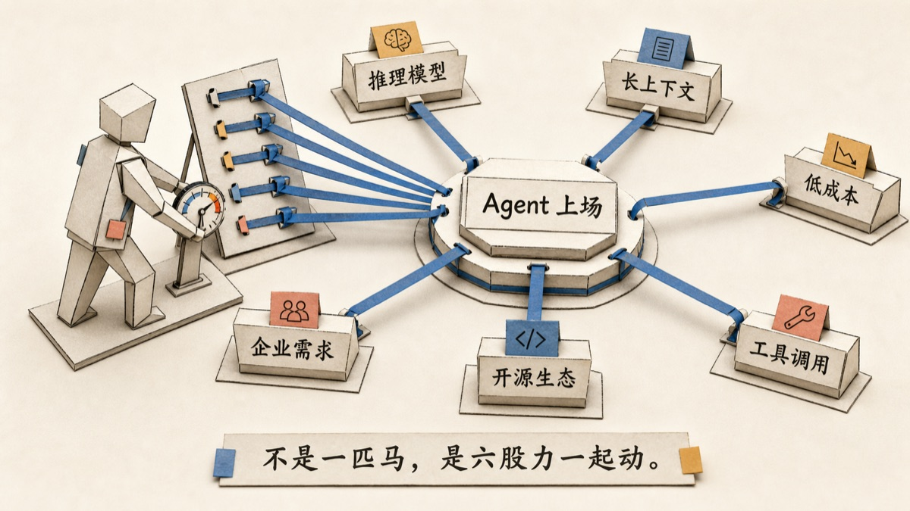

# Paper Operators / 纸片人

> 一个中文优先的 Agent 配图工作流：把文章里的判断、转折和复杂关系，变成清楚、好看、有动作感的纸片人正文配图。

[English](README.en.md)

Paper Operators 面向写作者、产品人、研究者、教师、创作者，以及所有需要把复杂想法讲清楚的人。它不是一个「可爱小人」画风包，而是一套可以迁移到多种 Agent 工具里的文章配图工作流：先读懂文章里真正值得画的那句话，再让无脸纸片人亲手完成关键动作。

这个仓库里已经提供了 Codex Skill 版本，但方法本身不依赖 Codex。Claude Code、Cursor、Hermes Agent、OpenClaw，或任何支持项目规则 / 自定义指令 / 工作流提示词的 Agent，都可以使用同一套规则。

纸片人会装框、捕光、牵线、检视、开闸、照料、称重、归档、修补。它不是站在旁边卖萌，而是在图里把抽象概念做出来。

<p align="center">
  
</p>

## 它解决什么问题

很多 AI 文章配图会掉进两个坑：要么好看但空泛，要么清楚但像 PPT。

Paper Operators 想要的是另一种状态：

- 读者三秒内知道这张图在讲什么
- 画面有纸张、器具、路径和动作，不是冰冷图标
- 中文标签默认可读，不再只给空白占位框
- 同一篇文章里的多张图风格统一，但每张图又贴合自己的段落
- 角色只在有用时出现，不能为了可爱而硬塞

一句话判断：如果把纸片人拿掉，图还是同样清楚，那这张图就不该画纸片人。

## 示例图

<table>
  <tr>
    <td width="50%">
      
      <br>
      <sub><strong>中文标签路线。</strong>观点、关系、状态、文字和结果沿着同一条路径展开。</sub>
    </td>
    <td width="50%">
      
      <br>
      <sub><strong>高空纸模舞台。</strong>适合系统、产品、城市、路线和多对象关系。</sub>
    </td>
  </tr>
  <tr>
    <td width="50%">
      
      <br>
      <sub><strong>艺术与审美。</strong>纸片人可以是装框员、捕光员、调色员，而不是工程流程图里的小工人。</sub>
    </td>
    <td width="50%">
      
      <br>
      <sub><strong>生活与心理。</strong>情绪、边界和照料，可以变成房间、屏风、天气卡和一盏被重新点亮的灯。</sub>
    </td>
  </tr>
  <tr>
    <td width="50%">
      
      <br>
      <sub><strong>边界房间。</strong>不是冷冰冰的流程图，而是把自我、余地和照料放回可见空间。</sub>
    </td>
    <td width="50%">
      
      <br>
      <sub><strong>产品、AI 与系统。</strong>团队、校验、上线、证据和路线，可以被组织成一个可读的桌面世界。</sub>
    </td>
  </tr>
  <tr>
    <td width="50%">
      
      <br>
      <sub><strong>从问答到派活。</strong>Chat、Copilot、Agent 的差异，不是名词差异，而是工作闭环差异。</sub>
    </td>
    <td width="50%">
      
      <br>
      <sub><strong>先摊材料。</strong>把证据、材料和结论的先后关系做成一眼能看的桌面秩序。</sub>
    </td>
  </tr>
  <tr>
    <td width="50%">
      
      <br>
      <sub><strong>Agent 上场。</strong>不是一匹马，是模型、上下文、工具、生态、成本和企业需求一起动。</sub>
    </td>
    <td width="50%">
      
      <br>
      <sub><strong>Agent 代办。</strong>牌桌从“用工具”变成“买结果”，配图也要画出付费对象的变化。</sub>
    </td>
  </tr>
</table>

说明：README 里展示的是为 GitHub 加载速度压缩过的预览图，不代表实际生成图的清晰度。旧版 PNG 示例仍保留在 [`examples/images/`](examples/images/) 目录，新加入的首页样图放在 `examples/images/readme/`。

## 适合谁

适合：

- 公众号、博客、newsletter、长文作者
- 产品、AI、商业、工程、教育、研究类内容
- 艺术评论、文化文章、个人经验、心理和生活类文章
- 需要「有人在做这件事」而不是只有箭头和方框的解释图
- 想为一篇文章生成一组统一但不单调的正文图

不适合：

- 只需要 logo、贴纸、表情包或装饰性 mascot
- 一张普通截图、表格或图表就能说清楚的内容
- 纸片人只能站在旁边凑气氛，不能参与核心动作的场景

## 工作流

1. 从文章里找出最值得画的 source anchor：一句话、一个转折、一个冲突或一个判断。
2. 写清楚读者看完图应该明白什么。
3. 判断领域和语气：艺术、文化、生活、产品、商业、工程、教育、心理等。
4. 选择纸片人的动作：装框、捕光、牵线、检视、开闸、照料、称重、归档、修补。
5. 回答 `what breaks if removed`，确认纸片人不是装饰。
6. 选择纸模世界：画廊工作台、边界房间、纸片小镇、档案桌、路线图、剖面图、货架矩阵等。
7. 写出短而可读的中文标签。
8. 生成一张图，并检查清晰度、动作、文字、构图和风格漂移。

规划输出通常长这样：

```text
source anchor:
reader takeaway:
domain and mood:
relationship type:
core action:
operator decision:
what breaks if removed:
operator family:
metaphor world:
primitives and state coding:
composition:
labels:
series plan (规划多张图时):
final image prompt:
QA risks:
```

## 更深的关系、更全的原元素、更强的串联

这一版把纸片人从「画好一张图」扩展到「精确画出关系，并把多张图串成一条论证」。新增了四层能力，依次取用：

- **关系语法（先定关系）** —— [`paper-operators/references/relationship-grammar.md`](paper-operators/references/relationship-grammar.md)
  先在 12 种关系里定位文章真正要画的那一种：连接、顺序·交接、依赖、因果·触发、反馈环、对比·对立、权衡·取舍、层级·包含、转化·状态迁移、边界·过滤·门槛、分流·汇聚、张力·均衡。每种关系都给出文章信号、视觉编码、对应 operator、以及一条「从随便一条箭头 → 精确到方向/条件/状态」的精度阶梯。先定关系再选 operator，图才不会塌成一条万能箭头。
- **原元素套件（搭场景的零件）** —— [`paper-operators/references/primitives.md`](paper-operators/references/primitives.md)
  把纸世界拆成一套可复用的原件：载体与路径、台面与托件、围合与边界、光学与光、度量与工具、状态容器、标签容器，以及纸片人构造件。一个原件只承担一个含义；同一含义在整组图里复用同一个原件，多张图才像一个世界。
- **状态编码（精度从这里来）** —— [`paper-operators/references/state-coding.md`](paper-operators/references/state-coding.md)
  不靠文字也能读出状态、程度、好坏：色彩语义、路径粗细与质感、高度层次、闸门姿态、边缘状态、光与强调、程度与数量。还给了「编码预算」——只让一两种编码承担文章的精度，其余保持中性，复杂也不糊。
- **串联与图集（把图连成一条论证）** —— [`paper-operators/references/series-and-chaining.md`](paper-operators/references/series-and-chaining.md)
  一篇文章常需要 2–6 张图。串联层规定：operator、配色、标签风格保持不变；一条蓝色主路径贯穿全集、状态逐张推进（松散→拉紧、杂乱→收拢、暗→亮、沉重→放下）；早早埋一个小母题，到收束图里回收。完整示例见 [`examples/series-prompts.md`](examples/series-prompts.md)。

这四层是组合关系：先定关系，用原元素和状态编码把它画准，多张图时再用一条主路径把它们串起来。

## 接入方式

### Codex

把 Skill 目录复制到 Codex skills 目录：

```bash
mkdir -p ~/.codex/skills
cp -R paper-operators ~/.codex/skills/paper-operators
```

重启 Codex 后即可使用：

```text
用 $paper-operators 给这篇文章规划 3 张正文配图，先不要生成图。
```

也可以直接生成一张：

```text
用 $paper-operators 根据下面这段文字生成一张 16:9 正文配图。

文字：
好的审美不是装饰，而是把注意力放到正确的位置。
```

### 其他 Agent 工具

如果你用的是 Claude Code、Cursor、Hermes Agent、OpenClaw 或其他 Agent 工具，不需要强行套 Codex Skill 格式。

使用这个通用指令包即可：

[`agent-guides/paper-operators-agent.md`](agent-guides/paper-operators-agent.md)

推荐接法：

| 工具 | 接入方式 |
| --- | --- |
| Claude Code | 使用 [`agent-guides/claude-code.md`](agent-guides/claude-code.md)，或把通用指令包摘到对应项目的 `CLAUDE.md`。 |
| Cursor | 使用 [`agent-guides/cursor-rule.mdc`](agent-guides/cursor-rule.mdc)，或把通用指令包改成 project rule。 |
| Hermes Agent | 作为可复用 workflow prompt / agent instruction。 |
| OpenClaw | 作为自定义 workflow 或项目级 Agent 指令。 |
| 其他 Agent | 只要支持 system / project / task instruction，就可以贴入通用指令包。 |

核心不是工具名，而是这条链路：`source anchor -> reader takeaway -> operator inclusion test -> domain adaptation -> final prompt -> QA`。

Hermes Agent 和 OpenClaw 应该都可以使用这套方法：把 [`agent-guides/paper-operators-agent.md`](agent-guides/paper-operators-agent.md) 作为 workflow prompt / 项目级指令给它们即可。它们不需要识别 Codex Skill 格式，只要能遵循普通 Markdown 指令，就能完成文章分析、构图规划、标签设计和最终提示词输出。

需要注意：跨 Agent 复用的是分析、构图和提示词工作流；最终成图质量仍取决于图像模型。Claude Code、Cursor、Hermes Agent、OpenClaw 可以负责规划和生成最终提示词；如果它们当前没有强生图能力，建议把 `final image prompt` 交给更强的图像模型渲染。具体兼容性见 [`agent-guides/compatibility.md`](agent-guides/compatibility.md)，也可以用 [`agent-guides/smoke-test.md`](agent-guides/smoke-test.md) 测试一个新 Agent 是否真的理解了这套工作流。

## 示例提示词

规划一篇文章的图包：

```text
用 $paper-operators 给下面这篇文章规划 3 张正文配图，先不要生成图。

要求：
- 中文读者优先
- 每张图都给 source anchor、reader takeaway、operator family、what breaks if removed
- 至少一张不是工程/产品图，要贴合文章领域

文章：
{paste article}
```

生成产品 / AI 系统配图：

```text
用 $paper-operators 生成一张产品/AI 系统配图。

Source anchor:
我不是在问一个 AI，而是在组织一群 AI 完成一条可验证的路线。

要求：
- operator family 选 Thread Runner + Lens Keeper
- 高空纸模城镇/工作台，蓝色路径从想法穿过 AI 团队、检查点、上线场景
- 必须出现短中文标签：想法、团队、校验、上线
```

生成艺术评论配图：

```text
用 $paper-operators 生成一张艺术评论配图。

Source anchor:
好的审美不是装饰，而是把注意力放到正确的位置。

要求：
- operator family 选 Frame Setter / Light Catcher
- 画廊工作台、装框、光卡、色票、留白
- 不要画成流程图、漏斗、节点网络
```

更多单图示例见 [`examples/prompts.md`](examples/prompts.md)；多图串联系列（产品/AI、艺术评论、生活/心理）见 [`examples/series-prompts.md`](examples/series-prompts.md)。

## 关注后续

这个仓库放的是可复用的 Skill 和示例。更完整的拆解、提示词、文章配图复盘、AI 写作和产品实践，我会继续写在公众号里。

如果你也关心这些问题：怎么让 AI 图不再像模板、怎么把文章里的判断画清楚、怎么把 Agent 工作流做成真正可复用的东西，欢迎关注「正在逐渐AI化」。

<p align="center">
  
</p>

## 仓库结构

```text
paper-operators/
├── README.md
├── README.en.md
├── LICENSE
├── NOTICE.md
├── assets/
│   └── wechat-official-account.png
├── agent-guides/
│   ├── claude-code.md
│   ├── compatibility.md
│   ├── cursor-rule.mdc
│   ├── README.md
│   ├── paper-operators-agent.md
│   └── smoke-test.md
├── examples/
│   ├── prompts.md
│   ├── series-prompts.md
│   └── images/
│       └── readme/
├── docs/
│   └── style-notes.md
└── paper-operators/
    ├── SKILL.md
    ├── agents/openai.yaml
    ├── references/
    │   ├── style-dna.md
    │   ├── relationship-grammar.md
    │   ├── operator-library.md
    │   ├── primitives.md
    │   ├── state-coding.md
    │   ├── domain-adaptation.md
    │   ├── series-and-chaining.md
    │   ├── prompt-template.md
    │   └── qa-checklist.md
    └── assets/examples/
```

外层仓库给人读，也提供跨 Agent 的通用指令；内层 `paper-operators/` 是可以直接安装到 Codex 里的 Skill。

## License

MIT. See [`LICENSE`](LICENSE).
